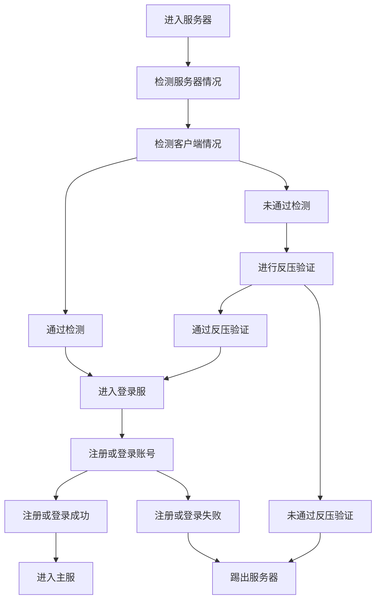

<!--  -->

欢迎加入 **StarLad** 服务器，在游玩之前阅读以下内容可以快速帮助你上手服务器
本篇教程为服务器基础教程，新手请认真学习

## 基础准备

在开始之前请确保您拥有以下基础：

- 具有自主能力 (例: 可独立查询Wiki | 可发现问题后查询Wiki | 可询问他人问题)
- 具有 Minecraft 基础 (例: 会安装 Minecraft | 会启动 Minecraft | 会进入服务器)
- 具有良好的网络环境 (例: 网络延迟低 | 网络带宽高)

#### 客户端需求

- Java 版 Minecraft 1.20.4 **(仅支持1.20.4)**
- 可选自行安装其他辅助性MOD，严禁外挂
**`推荐使用Optifine 使用Soudim(钠)可能会出现材质包问题`**

#### 客户端设置

启动后，请按照以下步骤进行设置：
1. 开启 `语言设置` 设置 `强制使用Unicode字体` 为 **关** 的模式

2. 进入 `多人游戏` 点击 `添加服务器` 并进行设置

    - 具体设置:
        - 设置服务器资源包为 **启用** 模式
        - 填写 **正确** 服务器地址
    - 服务器地址 `(下方可点击复制)`

      <button type="button" style="background-color: #4CAF50; color: white; padding: 10px 20px; border: none; border-radius: 5px; cursor: pointer;" onclick="navigator.clipboard.writeText('Play.mc233.fun')">
        主线 Play.mc233.fun
      </button>
      <button type="button" style="background-color: #008CBA; color: white; padding: 10px 20px; border: none; border-radius: 5px; cursor: pointer;" onclick="navigator.clipboard.writeText('V1.mc233.fun:44455')">
        备用1号 V1.MC233.Fun:44455
      </button>
      <button type="button" style="background-color: #f44336; color: white; padding: 10px 20px; border: none; border-radius: 5px; cursor: pointer;" onclick="navigator.clipboard.writeText('V2.mc233.fun:44455')">
        备用2号 V2.MC233.Fun:44455
      </button>

3. 进入服务器后，请按照提示完成注册流程

    - 下图展示为注册流程 **可忽略此部分**

4. 最后，享受冒险吧！
